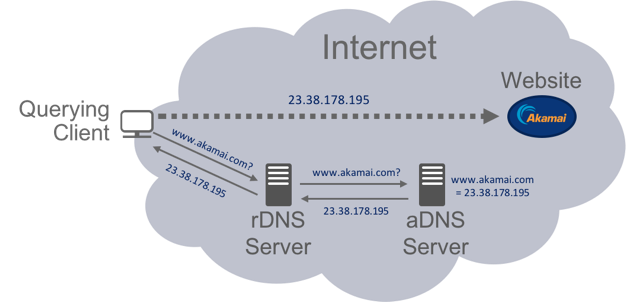
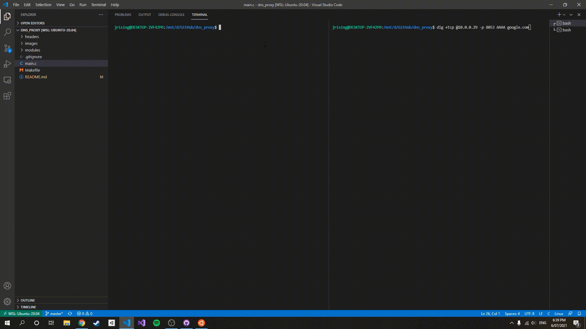

# DNS Proxy

## Table of contents
* [About](#about)
* [Project Structure](#project-structure)
* [Running Project](#running-project)
* [Further Reading](#further-reading)

<hr>

## About
Application can recieve and respond to TCP [IPv6 DNS][1] queries. Contents of queries are recorded and a log file is generated providing a history of all requests through proxy. Application caches recent queries, queries are expired in accordance to [TLL (time-to-live)][2].

[1]: https://datatracker.ietf.org/doc/html/rfc3596
[2]: https://datatracker.ietf.org/doc/html/rfc1035#section-3.2

### What is DNS?
Computers on the internet use IP addresses to communicate with each other. These addresses act as a unique identifier allowing traffic to be delivered to the correct destination. IP addresses like `142.250.70.206` (IPv4) or `2404:6800:4015:802::200e` (IPv6) are difficult to remember for humans as such we use hostnames such as `google` or `youtube` instead. However, our system still needs a way to find the IP from the hostname in order to communicate. This is where DNS comes in. DNS (Domain Name System) returns an IP address given a hostname, done by DNS servers communicating with nameservers which hold records containing hostnames and there IP address, if a nameserver contains the records it will return the IP address, if not the DNS server will then check another nameserver, the process repeats until the address is found. Nameservers are usually set up in a hierarchical structure as shown below.

<br/>
<p align="center">

<br/>
DNS Nameserver Hierarchy
</p>
<br/><br/>
<p align="center">

<br/>
DNS Process Example
</p>

<hr/>

## Project Structure
| Directory | Description |
| :-- | :-- |
| main.c | Entry point of program |
| headers/| Folder containing all header files for program |
| modules/| Folder containing all c files for subsequent header files |
| modules/dns.model.c | Models DNS query structure into struct |
| modules/socket.c | Provides various socket related functions such as creating server and client sockets |
| modules/cache.c | Provides caching functionality. Utilised linked list |
| modules/log.c | Provides logging functions to create dns_svr.log. Provides time functions to concat and generate timestamps |
| modules/util.c | Provides a series of utility functions such as Concatenating/splitting N-bits and printing hex representation of binary data |
| images/ | Folder containing images used in README |

<hr/>

## Running Project
Project must be run in an **Unix environment** due to unix dependent C libraries. 
Once project has been loaded in a unix environment (e.g. Ubuntu) use the Makefile to compile the various scripts. Type `make` in the terminal to do so.
This will generate a `dns_svr` executable. 

The application can be run using the following command:

```
./dns_svr <server-ip> <server-port>
```

Where, 

* **server-ip**: <br/>Is the Ipv4 address of the resolver server (a real world nameserver), use `cat /etc/resolv.conf` to see your local nameserver ip.
* **server-port**: <br/>Is the port that the nameserver with ip specified before is listening on. My default DNS uses `port 53`

When running theapplication will print `Listening on port 8053`, we can now send IPv6 queries to our proxy. This can be done with third-party tools such as [dig][3], use `sudo apt install dig` in Ubuntu to install dig.

<br/><br/>

With dig we can use the following command to send a query for google.com:
```
dig +tcp @<your ip address> -p 8053 AAAA google.com
```
Note, `+tcp` indicates we are using TCP to send the query. `AAAA` specifies we want to recieve the IPv6 address.

Use `hostname -I` to find your local IP address in unix environment.

To terminate application use SIGNINT (e.g. CTRL-C).

<p align="center">

<br/>
Running Application Demo
</p>

<hr>

## Further Reading
For more information regarding DNS query headers and overall structure refer to [this article][3].

[3]: https://routley.io/posts/hand-writing-dns-messages/